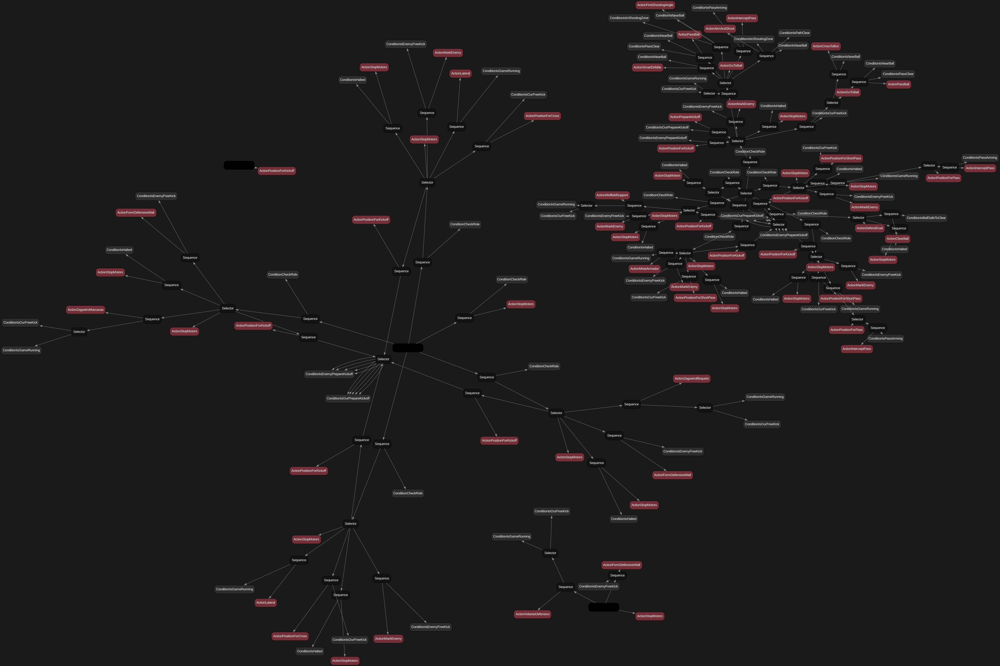

# 🤖 SSL Tactical Engine

<p align="center">
  <strong>Multi-Agent Tactical Strategy for RoboCup Small Size League</strong><br>
  LabIND · Roboteam · UDESC
</p>

<p align="center">
  
  
  
  
</p>

---

## 📖 Sobre o projeto

O **SSL Tactical Engine** é o motor de estratégia e inteligência artificial desenvolvido para uma equipe de robôs da **RoboCup Small Size League (SSL)**.

O projeto é desenvolvido no **LabIND — Laboratório de Inteligência Artificial e Robótica da UDESC**, como parte de uma pesquisa de Iniciação Científica.

A estratégia foi projetada como um sistema **multiagente, modular e reativo**, no qual cada robô toma decisões locais a partir de um estado compartilhado do campo, enquanto um componente central — o **Maestro** — distribui dinamicamente os papéis táticos entre os robôs.

A arquitetura combina:

- **Behavior Trees** para tomada de decisão;
- **Maestro** para coordenação e distribuição de papéis;
- **Artificial Potential Fields (APF)** para navegação e desvio de obstáculos;
- **SSL-Vision** para percepção do estado do campo;
- **SSL Game Controller** para interpretação das regras e comandos do árbitro;
- **UDP / ZeroMQ / Protobuf** para comunicação;
- **Docker** para reprodutibilidade do ambiente;
- **Groot** para visualização e depuração das Behavior Trees.

---

## 🧠 Arquitetura

O fluxo principal da estratégia é:

```text
                 ┌──────────────────────┐
                 │      SSL-Vision      │
                 │  Estado do campo     │
                 └──────────┬───────────┘
                            │
                            ▼
                 ┌──────────────────────┐
                 │     World State      │
                 │     / Blackboard     │
                 └──────────┬───────────┘
                            │
              ┌─────────────┴─────────────┐
              ▼                           ▼
     ┌────────────────┐          ┌────────────────┐
     │    Referee     │          │    Maestro     │
     │ Game Controller │          │ Papéis táticos │
     └───────┬────────┘          └───────┬────────┘
             │                           │
             └─────────────┬─────────────┘
                           ▼
                 ┌──────────────────────┐
                 │    Behavior Tree     │
                 │   Decisão por robô   │
                 └──────────┬───────────┘
                            │
                            ▼
                 ┌──────────────────────┐
                 │       Actions        │
                 │ Objetivo / intenção  │
                 └──────────┬───────────┘
                            │
                            ▼
                 ┌──────────────────────┐
                 │         APF          │
                 │ Navegação local      │
                 └──────────┬───────────┘
                            │
                            ▼
                 ┌──────────────────────┐
                 │     ActionClient     │
                 │ Comandos ao robô     │
                 └──────────────────────┘
```

A ideia central é separar responsabilidades:

> **Maestro:** quem deve fazer o quê?  
> **Behavior Tree:** qual comportamento executar?  
> **Action:** qual objetivo deve ser perseguido?  
> **APF:** como chegar ao objetivo evitando obstáculos?  
> **ActionClient:** como transmitir o comando ao robô?

---

## 🌟 Principais Funcionalidades

*   **🧠 Arquitetura com Behavior Tree:** Motor de decisão modular (`Selector`, `Sequence`, `Action`, `Condition`) construído do zero, permitindo a criação de táticas complexas de forma clara e expansível.
*   **📡 Sistema Multi-Agente (O "Maestro"):** Algoritmo que distribui papéis dinamicamente (Atacante, Goleiro, Zagueiros, etc.) em tempo real, usando a posição da bola e lógica de histerese para garantir estabilidade tática.
*   **🧲 Navegação por APF Avançado:** Uso de Campos Potenciais Artificiais com "bolha de segurança" dinâmica e repulsão diferenciada para robôs e paredes, garantindo desvios suaves e eficientes.
*   **🛡️ Goleiro Inteligente:** Posicionamento preditivo para interceptar chutes e lógica de "fechar o ângulo" baseada na bisseção do ângulo entre a bola e as traves.
*   **👁️ Visualização com Groot:** Geração automática de arquivos XML compatíveis com o **Groot**, o editor visual padrão da indústria para Behavior Trees, permitindo depuração e design de táticas de forma gráfica.
*   **🐳 100% Dockerizado:** O ambiente de desenvolvimento e execução é totalmente encapsulado em um contêiner Docker, garantindo consistência e eliminando problemas de dependências.

---

## 🚀 Execução

O projeto utiliza Docker para manter o ambiente de execução consistente.

### Pré-requisitos

Instale:

- Docker;
- Docker Compose;
- um ambiente SSL funcional;
- SSL-Vision;
- simulador compatível, como grSim, quando utilizado em simulação.

O repositório fornece tanto `Dockerfile` quanto `docker-compose.yml`.

### Build

Na raiz do projeto:

```bash
docker build -t labind-ssl-ai .
```

### Executar para o time amarelo

```bash
docker run --rm --network=host labind-ssl-ai --team yellow
```

### Executar para o time azul

```bash
docker run --rm --network=host labind-ssl-ai --team blue
```

### Executar os dois times com Docker Compose

O `docker-compose.yml` fornece serviços separados para azul e amarelo:

```bash
docker compose up --build
```

Para executar apenas um deles:

```bash
docker compose up --build time_amarelo
```

ou:

```bash
docker compose up --build time_azul
```

> O uso de `network_mode: host` permite que os containers utilizem diretamente a rede do host para comunicação com os componentes SSL.

---

## 🎨 Visualizando as Behavior Trees

O projeto possui ferramentas para gerar uma paleta de nós e arquivos XML para visualização no Groot.

### 1. Gerar a paleta

```bash
python3 generate_palette.py
```

Isso gera:

```text
diagramas/nodes_palette.xml
```

### 2. Gerar a árvore

Ao executar a estratégia, o projeto gera a representação XML da árvore mestra:

```text
diagramas/arvore_mestra.xml
```

### 3. Abrir no Groot

No Groot:

1. carregue `diagramas/nodes_palette.xml` como **Node Palette**;
2. abra `diagramas/arvore_mestra.xml`;
3. utilize a árvore para inspecionar a estrutura da estratégia.

---

## Arquitetura Tática (Behavior Tree)
A imagem abaixo mostra uma visualização estática da árvore de comportamento gerada a partir do código. Para uma visualização interativa, utilize o **Groot** conforme as instruções acima.



---

## 🗂️ Estrutura do projeto

```text
labind-ssl-ai/
│
├── main.py
│   └── Ponto de entrada e ciclo principal da estratégia
│
├── behavior_tree/
│   ├── core.py
│   │   └── Motor e classes base da Behavior Tree
│   │
│   ├── conditions.py
│   │   └── Condições utilizadas para tomada de decisão
│   │
│   └── actions.py
│       └── Comportamentos e ações dos robôs
│
├── proto_msg/
│   └── Mensagens geradas a partir dos arquivos Protobuf
│
├── diagramas/
│   ├── mapa_arvore_mestra.png
│   ├── nodes_palette.xml
│   └── arvore_mestra.xml
│
├── generate_palette.py
│   └── Geração da paleta de nós para o Groot
│
├── treino.py
│   └── Ferramentas auxiliares relacionadas ao treinamento/ajuste
│
├── Dockerfile
├── docker-compose.yml
├── requirements.txt
├── .dockerignore
├── .gitignore
└── README.md
```

---

## 🔄 Ciclo de decisão

A estratégia executa continuamente um ciclo semelhante a:

```text
1. Receber estado da visão
        ↓
2. Atualizar posição/velocidade da bola
        ↓
3. Receber estado do árbitro
        ↓
4. Atualizar o Blackboard
        ↓
5. Maestro redistribui os papéis
        ↓
6. Selecionar a Behavior Tree de cada robô
        ↓
7. Executar Conditions e Actions
        ↓
8. Calcular navegação através do APF
        ↓
9. Enviar comando ao robô
        ↓
10. Repetir
```

O loop principal foi projetado para operação em tempo real e utiliza comunicação não bloqueante para priorizar os estados mais recentes.

---

## 🧩 Papéis e tomada de decisão

A estratégia não associa permanentemente um papel a cada ID de robô.

Em vez disso:

```text
Estado do campo
      ↓
    Maestro
      ↓
Distribuição dinâmica
      ↓
Behavior Tree correspondente
```

Isso permite que a equipe continue funcionando quando:

- um robô deixa de estar disponível;
- a bola muda de região;
- a situação ofensiva muda;
- a equipe precisa recompor;
- outro robô passa a ser mais adequado para determinada função.


---

## 🏫 Projeto

**LabIND — Laboratório de Inteligência Artificial e Robótica**  
**UDESC — Universidade do Estado de Santa Catarina**

Projeto desenvolvido no contexto de pesquisa em **robótica, inteligência artificial e futebol de robôs**.

---

## 🔗 Repositório

[GitHub — Danielgmichels/labind-ssl-ai](https://github.com/Danielgmichels/labind-ssl-ai)

---

## 📄 Licença

Consulte o arquivo `LICENSE` do repositório para informações sobre licenciamento.
